# 教室で使えるかもしれないもの作り #◯ 「見つけたよ」が、その子のノートで終わらない。町たんけんの気づきが1枚の地図に集まるアプリ「みっけ！」

## 🏫 はじめに

町たんけんから帰ってきた子どもたちのワークシートを、放課後にひとりぶんずつめくりながら、もったいないな、と思ったことはありませんか。

「郵便ポストがあった」「消火栓が8こもあった」「この道はせまいのに車がよく通る」。ひとつひとつは、その子がちゃんと立ち止まって見てきた証拠です。それなのに、書かれた場所がその子の紙の上なので、ほかの子の目には入りません。教室で発表しても、聞いているほうは「それ、どのあたりの話だろう」と分からないまま、なんとなく拍手をして終わってしまう。黒板に大きな地図を貼って付せんを貼らせるやり方もありますが、写真は貼れませんし、はがれます。そして何より、貼らせて並べる時間がありません。

「みっけ！」は、先生が用意した1枚の地図の画像に、子どもたちが見つけたものをピンとして貼っていくアプリです。ピンには、なまえとメモと写真をつけられます。友だちのピンを開いてコメントを書いたり、いいねを送ったりもできます。子どもが見つけたものが、見つけた場所の上に置かれる。それだけのアプリですが、「どこの話か」が一目で分かるようになります。

地図は先生が用意した画像を使うので、町たんけんだけのものではありません。校庭の生きものさがし、避難経路の危険さがし、校区の安全マップ、修学旅行の下調べなど、地図や見取り図があるところなら同じように使えます。

こちらから使えます。
https://townmap-mikke.giga-school.com/

じつはこのアプリには前の版があって、そのときはクラスごとにスプレッドシートを用意して、先生がひとつずつ共有の設定をする必要がありました。そこがいちばんの壁だったので、まるごと作り直しました。いまは、先生が共通のリンクを開いてクラス名を入れるだけで、記録用のスプレッドシートが先生のドライブにでき、アプリから読み書きするための共有まで自動で終わります。先生がさわる設定は、ひとつもありません。

なお、この記事に出てくる画面写真は、サンプルのクラスをつくって実際に動かし、そのまま撮ったものです。写っている子どもの名前や書きこみは、この記事のために用意したもので、実在の子どものものではありません。

## 📱 このアプリでできること

子どもの画面は、地図が一枚あるだけです。上のタブと、下の3つのボタン以外に、押すところがありません。低学年でも迷わないように、余計なものを置きませんでした。読む文字にはふりがながついています。

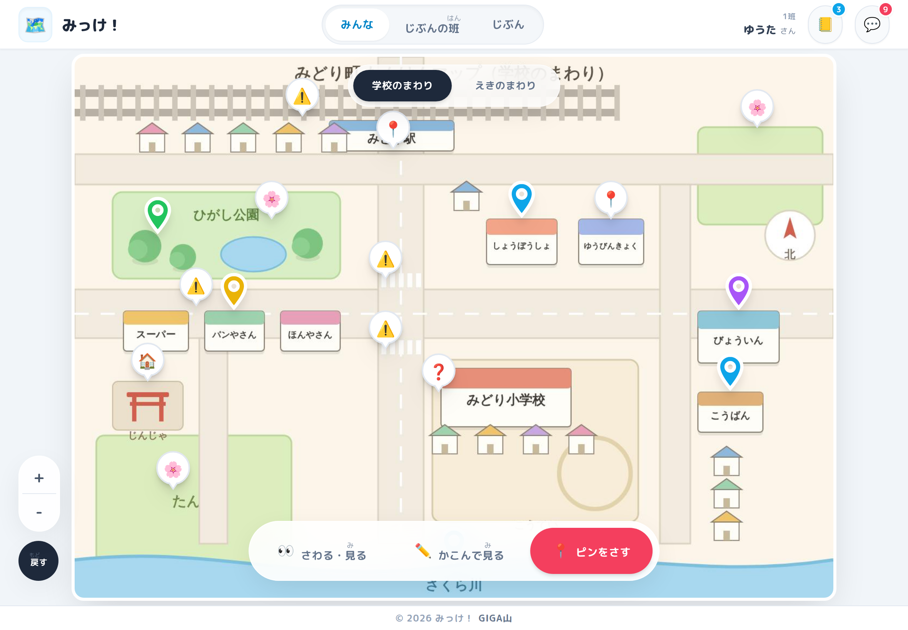

子どもの画面。みんなが見つけたものが、見つけた場所の上に並びます。

地図をタップすると、その場所に新しいピンを作る画面が開きます。アイコンを選んで、なまえを書いて、メモを書いて、必要なら写真をつける。それだけです。

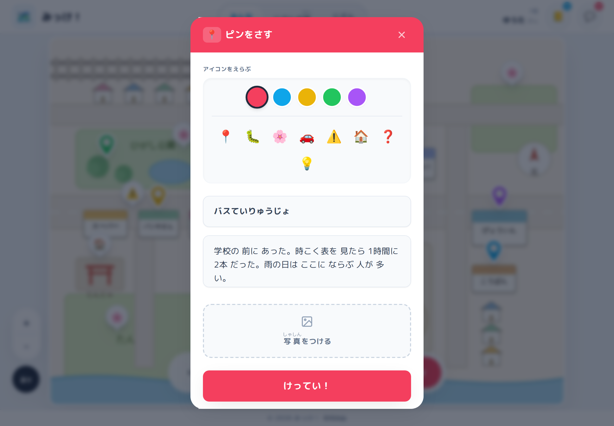

なまえは100字まで、メモは1000字まで書けます。写真は端末のカメラでもアルバムからでも構いません。

写真は、送る前に端末の中で長辺600ピクセルまで小さくしてから送っています。これは見た目の都合ではなく、学校のネットワークで30人がいっせいに写真を送っても詰まらないようにするためです。地図の画像も同じように、長辺1400ピクセルまで小さくしてから保存されます。紙の地図を写真に撮ったものをそのまま入れて構いません。

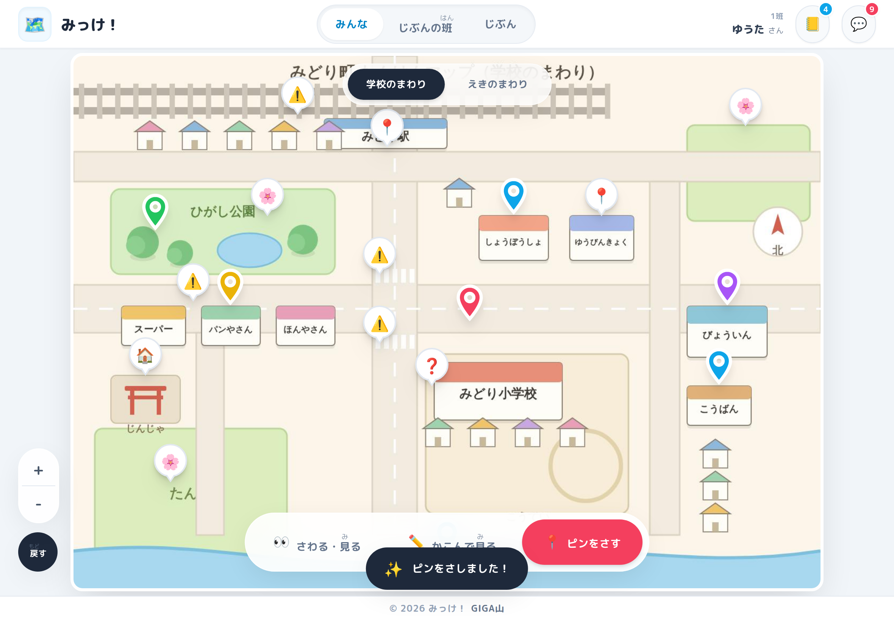

決定を押すと、その場でピンが増えます。ほかの子の画面にも、しばらくすると出てきます。

ピンをタップすると、書いた子の名前と班、写真、メモ、いいね、コメントが出ます。

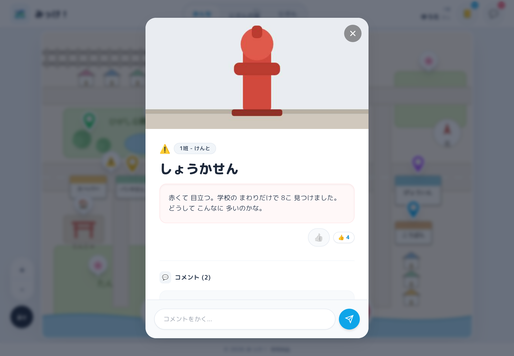

自分のピンは、なまえもメモも写真も、あとから何度でも書き直せます。ほかの子のピンは書き直せません。

ピンの見た目は、5色のピンのほかに絵文字のスタンプも選べます。はじめは花や虫や車など8種類が入っていますが、先生が自由に決められます。危ないと思ったところは注意のしるし、すてきだと思ったところは花のしるし、といった約束を先に決めておくと、地図を眺めるだけで学級全体の傾向が見えてきます。

自分が書いたものは「わたしのきろく」にまとまります。ことばで検索できて、その場で書き直したり、地図のその場所に飛んだりできます。

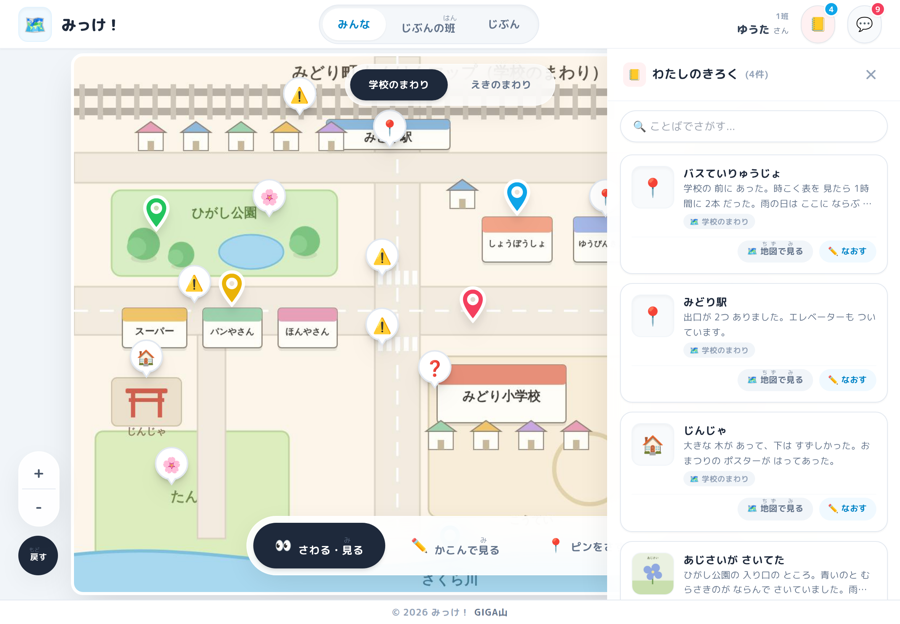

自分のピンだけが新しい順に並びます。ふりかえりの時間に、この画面を見ながら書く子がいるといいなと思って作りました。

地図は指2本でひろげたり、マウスのホイールでも拡大できます。最大で6倍まで寄れるので、こまかい書きこみの多い地図でも大丈夫です。

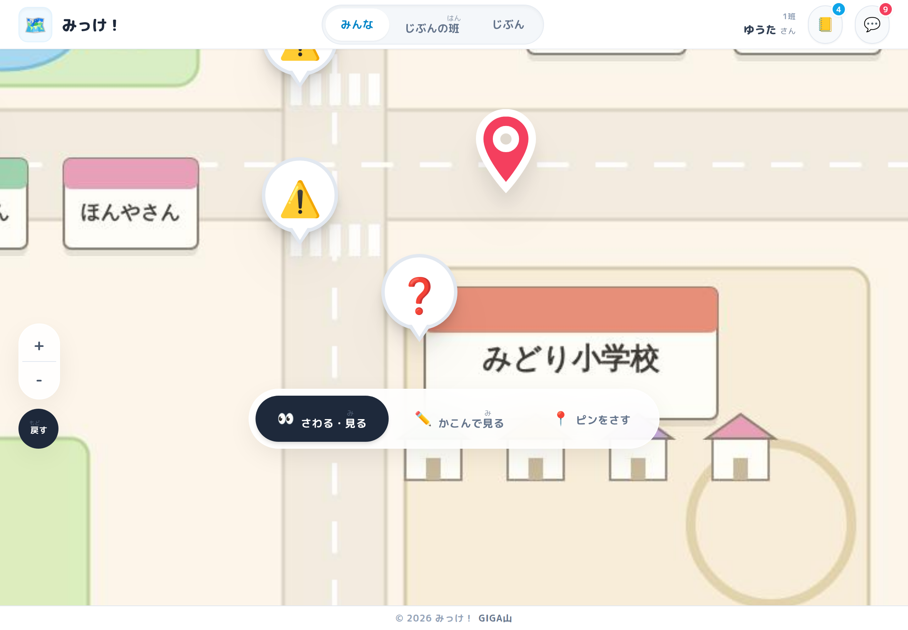

「戻す」を押せば、いつでも元の表示に戻ります。迷子にならないように、この逃げ道だけは必ず置くようにしています。

## 🔍 見たいところだけ、切り取って見る

ピンが増えてくると、地図はにぎやかになります。にぎやかなのはいいことですが、話し合いのときには困ります。「今日は駅前の話をします」と言っても、画面には町じゅうのピンが出たままだからです。

そこで、見たいところだけを切り取る道具を3つ入れました。

ひとつめは「かこんで見る」です。指で地図をなぞって囲むと、その中に入っているピンだけが一覧で出ます。

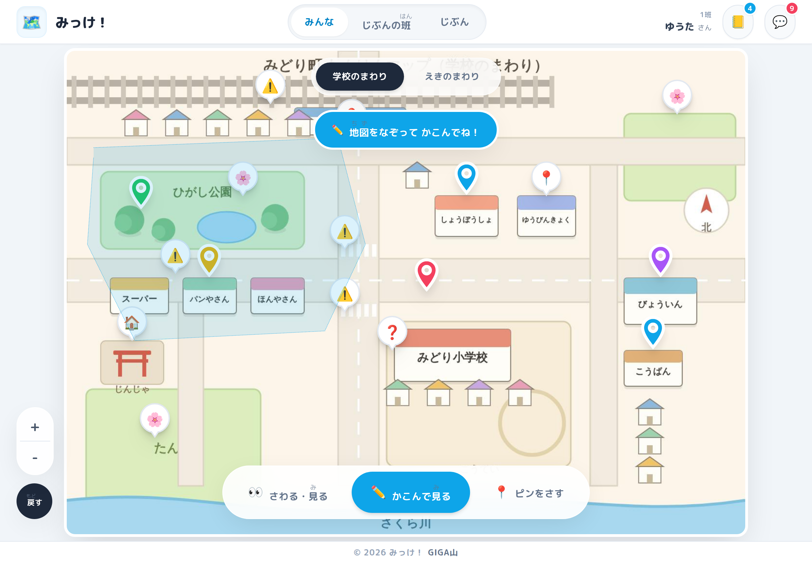

なぞった線がそのまま輪になります。きれいな形でなくても大丈夫です。

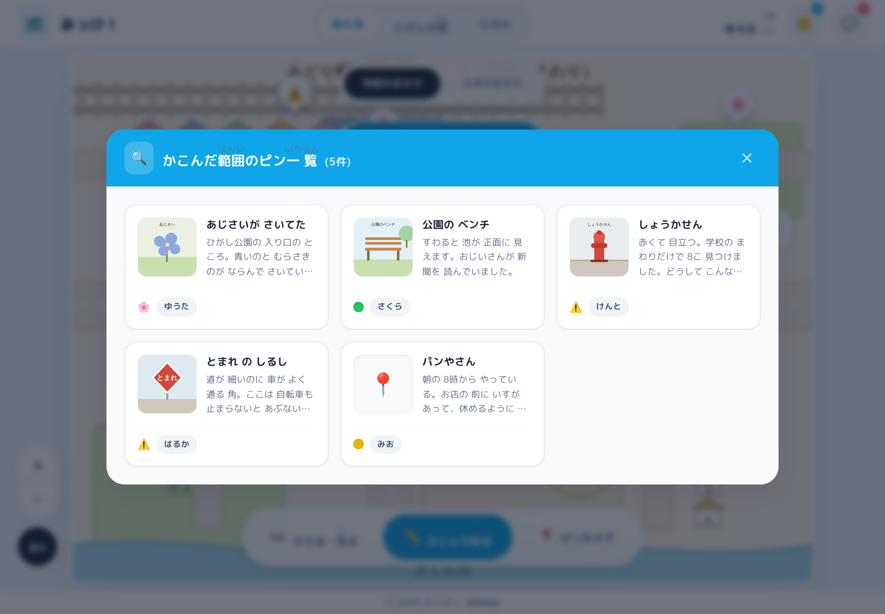

囲んだ中のピンが、書いた子の名前つきで並びます。「この通り沿いだけ見てみよう」という指示が、そのまま操作になります。

ふたつめは、画面の上にある「みんな・じぶんの班・じぶん」の切りかえです。班で見れば、班の話し合いのときに自分たちの記録だけを見られます。

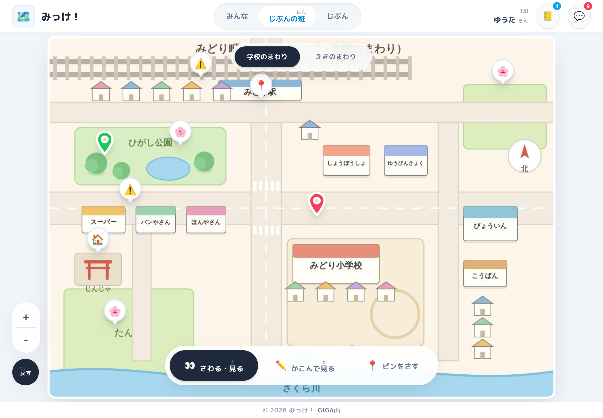

同じ班の子のピンだけが残ります。この切りかえは子どもの画面にだけ出るようにしました。先生の画面はいつも全員ぶんが見えていてほしいからです。

みっつめは、地図そのものを増やすことです。同じ単元に2枚目の地図を足すと、上にタブが出ます。

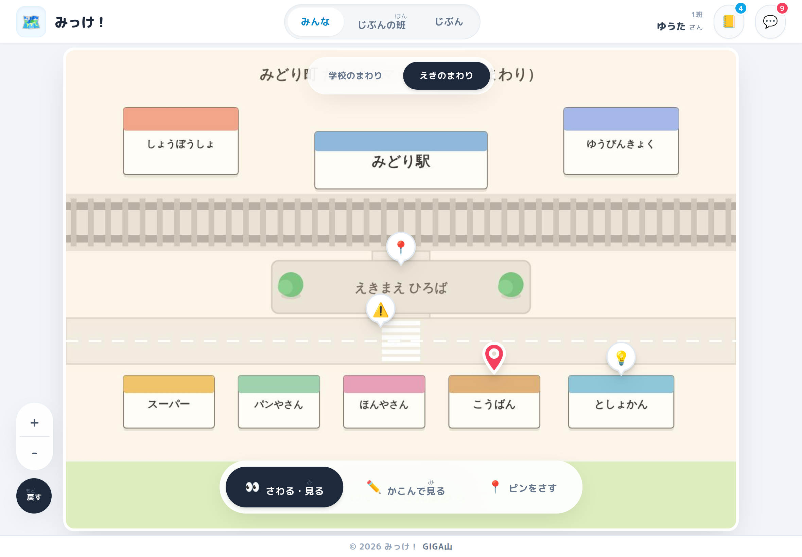

「学校のまわり」と「えきのまわり」のように場所で分けてもいいですし、「たんけん前の予想」と「たんけん後の結果」で分けることもできます。地図を追加するときに、1枚目のピンをそのままコピーする選択肢があるので、予想と結果を同じ位置で見比べられます。

## 💬 ピンの上ではじまる話し合い

このアプリで、いちばん時間をかけて考えたのが、この部分です。

子どもたちが端末で書きこめるようにすると、必ず「おしゃべりが止まらなくなったらどうするか」という話になります。かといって、書きこみを全部止めてしまうと、ただの提出箱になってしまいます。

そこで、話す場所を2つに分けました。

ひとつは、ピンの中のコメントです。誰かのピンを開いて、そのピンについてだけ書きこめます。話題がピンにひもづいているので、脱線しようがありません。

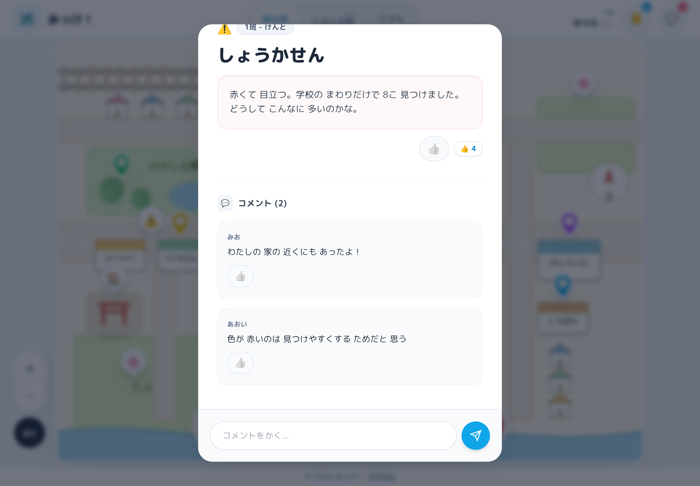

「わたしの家の近くにもあったよ」「色が赤いのは見つけやすくするためだと思う」。ひとつの気づきに、ほかの子の気づきが重なっていきます。

もうひとつは「みんなのひろば」です。クラス全体で使うチャットで、誰かの発言に返信したり、いいねを送ったりできます。先生もここに書けます。

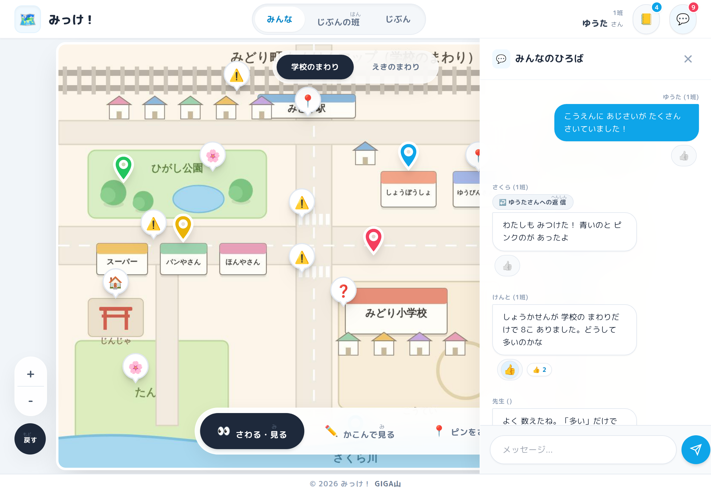

先生の発言も同じ場所に並びます。全員に向けた声かけを、手を止めさせずに届けられます。

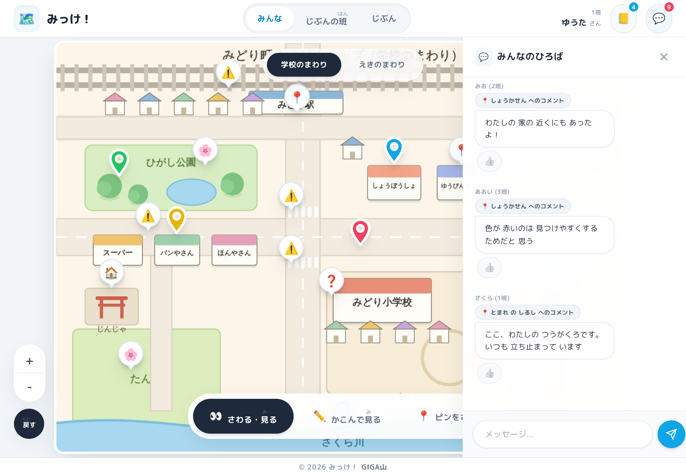

ピンについたコメントも、どのピンへのコメントかという見出しつきで、ここに流れてきます。先生はこの画面をながめているだけで、いま何が話題になっているかが分かります。

そして、この2つは別々に止められます。管理パネルでチャットをオフにすると、みんなのひろばの入力欄は閉じますが、ピンへのコメントはそのまま書けます。おしゃべりは止めたい、でも気づきの重なりは止めたくない。授業の後半でよくある状態を、そのまま設定にしました。

## ✨ 導入のメリット

三つのいいことが期待できます。

一つ目は、記録を集めて並べる仕事がなくなることです。ワークシートを回収して、名前順に並べて、掲示物を作って、返す。この流れがまるごと消えます。子どもが書いた瞬間に、それはもう地図の上に並んでいて、先生の管理画面からいつでも見られます。放課後にやることが一つ減るというのは、けっこう大きいのではないかと思います。

二つ目は、発表が「どこの話か」で止まらなくなることです。地図の上に置かれた記録は、場所の情報を最初から持っています。「駅の近くに危ないところが集まっている」「学校の東側だけ、生きものの記録が少ない」といった、一人では気づけないことが、全員ぶんを重ねたときに見えてきます。子どもたちが自分たちで見つけたことのほうが、こちらが用意した問いより強いと思います。

三つ目は、一人ひとりの記録がそのまま残ることです。管理パネルの学習分析で子どもを選ぶと、その子が書いたピンの数、発言の数、刺したピンの一覧が出ます。

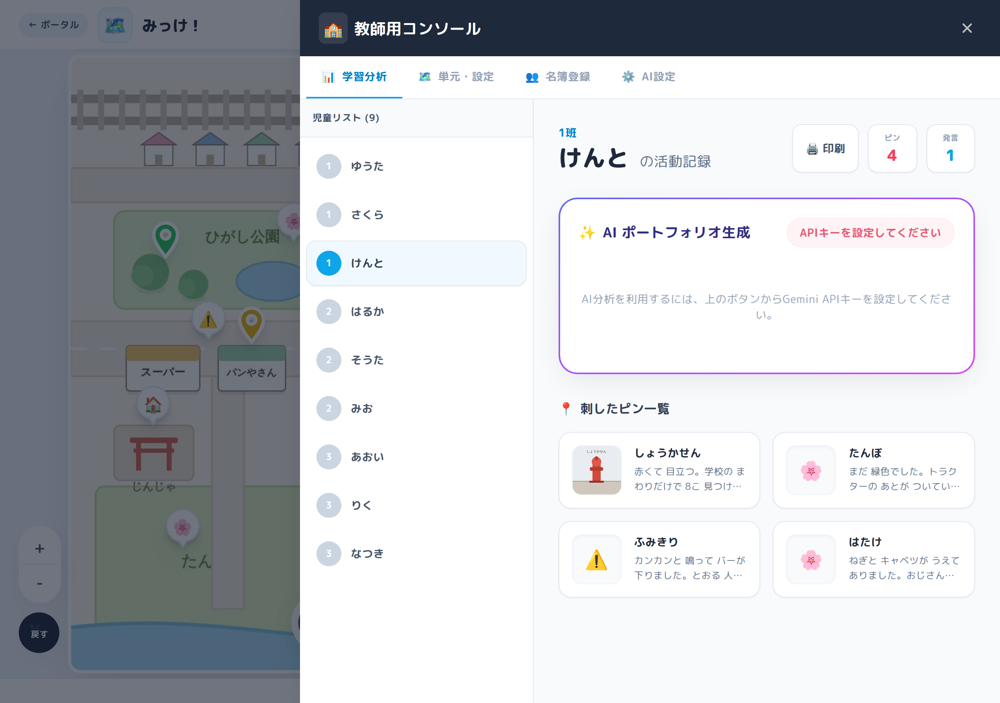

写真とメモがそのまま並ぶので、印刷ボタンを押せばポートフォリオになります。所見を書くときや、保護者に見てもらうときに使えると思って作りました。

ここには、Gemini というグーグルの AI に、その子の興味の傾向、よかったところ、先生からのひとことを下書きさせる機能もつけてあります。ただしこれは完全に任意です。使わなくても、ほかのすべての機能はそのまま使えます。使う場合の鍵は、そのクラスのスプレッドシートの中だけに保存されます。

## 🛠️ 【管理者向け】導入手順

情報担当の先生に聞かれることを、先にまとめておきます。

### 先生がすること

1. 学校から知らされた共通のリンクを開き、先生のアカウントでサインインします。初回だけ許可を求める画面が出ます。求められるのは、スプレッドシートの操作と、外部への問い合わせと、本人のメールアドレスの確認の3つだけです。写真や書類をあさる権限は求めません。
2. クラス名を入れて、クラスを作成を押します。

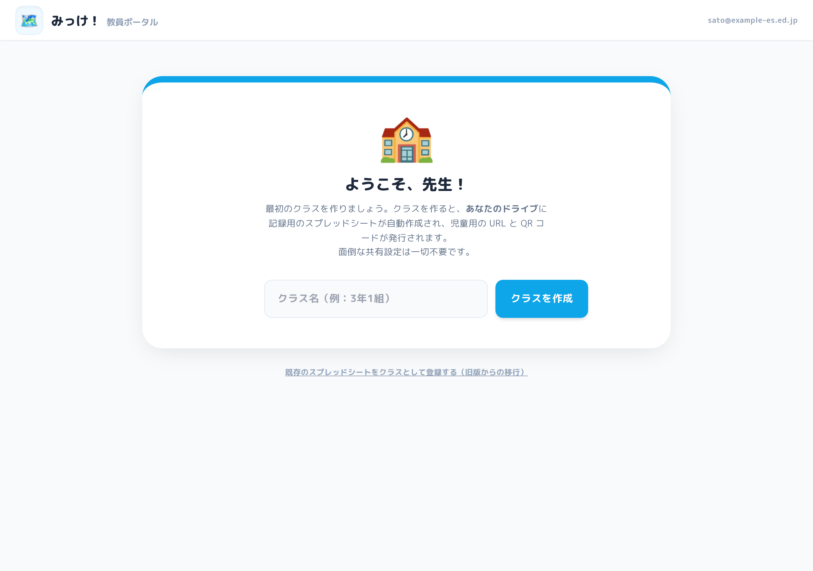

最初のクラスを作るところ。入れるのはクラス名だけです。

3. 記録用のスプレッドシートが先生のドライブにできて、児童用のリンクと QR コードが出ます。

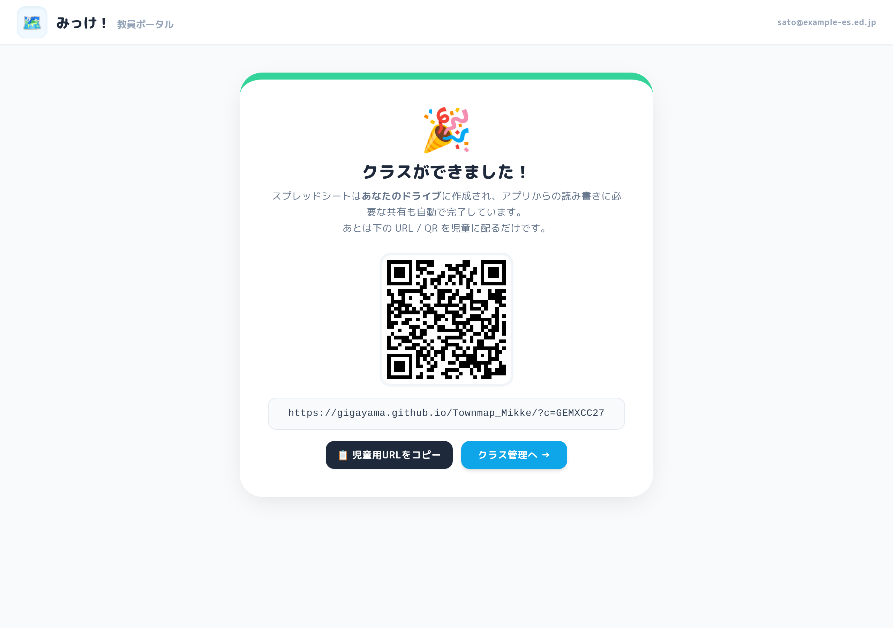

共有の設定は自動で終わっています。ここから先、先生がスプレッドシートをさわる必要はありません。

4. QR コードを電子黒板に映すか、リンクをコピーしてクラスルームなどで配ります。

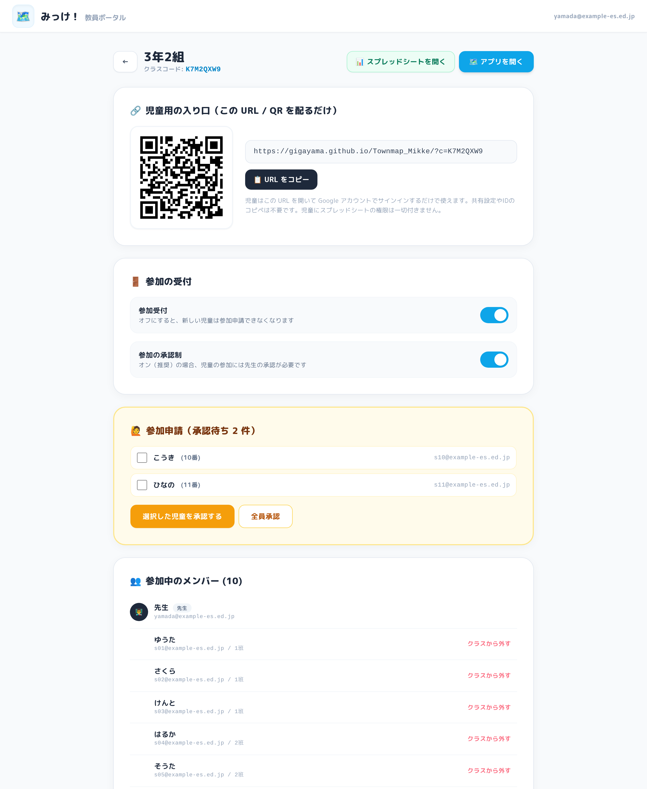

クラス管理の画面。リンクと QR、受付のスイッチ、参加申請、名簿がこの1枚にまとまっています。

5. 子どもがリンクを開いて名前を入れると、参加申請として届きます。チェックを入れて承認するか、全員承認を押します。

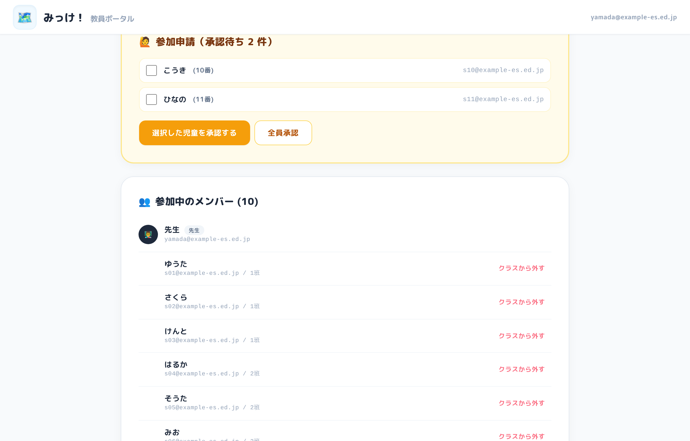

承認された子の画面は、そのまま待っていれば自動で切りかわります。20秒ごとに確認しているので、読み込み直してもらう必要はありません。

6. 授業前にまとめて登録しておきたいときは、管理パネルの名簿登録タブに、メールアドレスと表示名と班名を1行ずつ貼りつけます。1回に200人まで登録できます。この方法で登録した子は、承認なしですぐ参加できます。

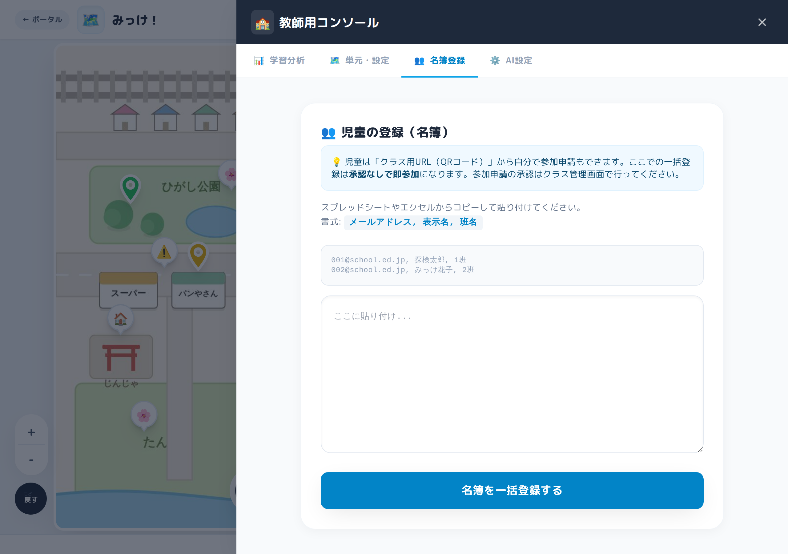

班名を入れておくと、子どもが「じぶんの班」でしぼりこめるようになります。

7. アプリを開き、管理パネルの単元・設定で、地図の画像を選んで単元を開始します。

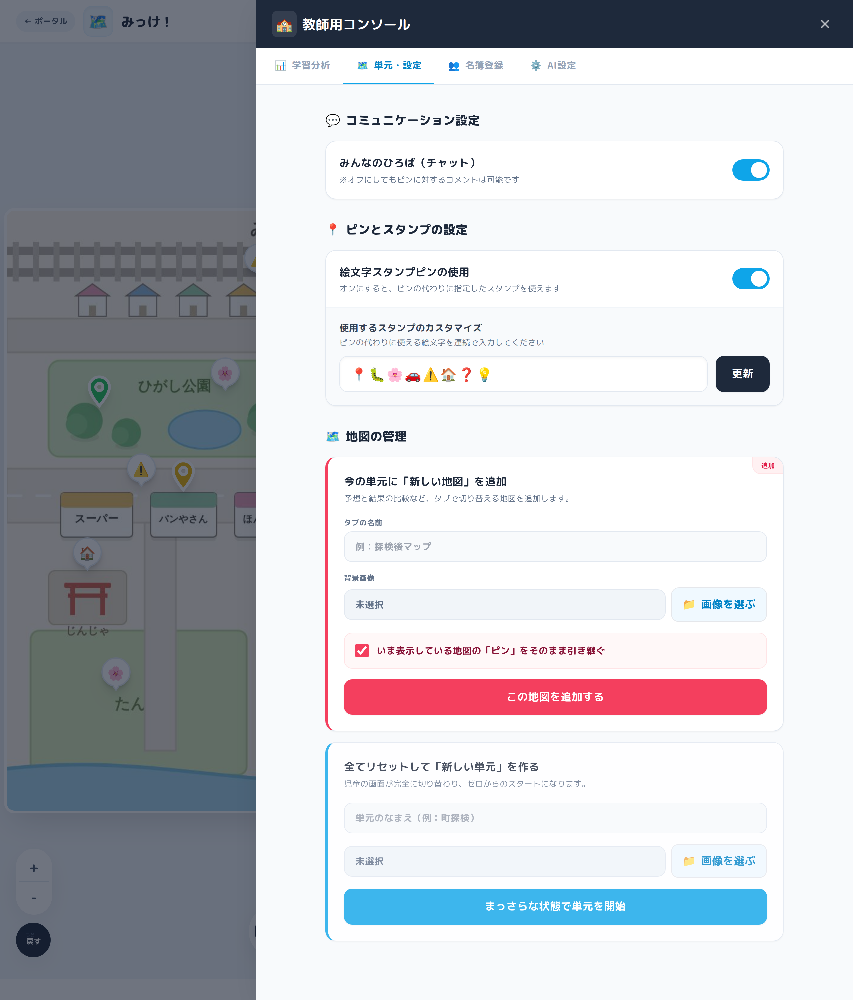

チャットの入切、スタンプの中身、地図の追加、新しい単元の開始が、この1枚にあります。

### 情報担当の先生に確認してもらうこと

個人情報については、子ども側の画面に出るのは表示名と班だけです。ほかの子のメールアドレスは出ません。名前はニックネームでも構いません。記録用のスプレッドシートは、そのクラスを作った先生のドライブにあり、子どもには権限が一切ありません。リンクを知っていても開けません。

クラスのリンクを知っているだけでは参加できない作りです。クラスコードは紛らわしい文字を除いた32種類の文字を8桁ならべたもので、組み合わせは1兆通りをこえます。それでも、コードは宛先であって合いことばではないと考えているので、名簿にない人は参加できないところで止まります。参加の承認制は、はじめから入になっています。リンクが学外に漏れたときは、管理画面からコードを作り直せます。古いリンクと QR はその場で使えなくなり、名簿と記録はそのまま残ります。

校内のフィルタリングでは、次のアドレスを通してもらう必要があります。アプリの置き場所として script.google.com と googleusercontent.com、入り口の置き場所として townmap-mikke.giga-school.com、サインインのために accounts.google.com、記録のために docs.google.com、画面を組み立てる部品のために unpkg.com と cdn.tailwindcss.com、書体のために fonts.googleapis.com と fonts.gstatic.com です。AI の機能を使う場合だけ generativelanguage.googleapis.com も必要になります。部品の置き場所が止められていると、画面がまっ白のまま動きません。

学校が Google Workspace for Education を使っている場合、18歳未満のアカウントは外部のアプリを使えない設定が既定になっています。これは先生の操作では直せません。管理コンソールで、このアプリを信頼済みとして許可してもらう必要があります。学校ごとに一度だけ必要な作業です。

インターネットにつながっていないと記録の読み書きはできません。圏外のときは、その旨の画面が出ます。共用の端末では、使い終わったらサインアウトしてもらってください。サインインの情報はタブを閉じると消える場所にだけ置いていますが、開いたままだと次の子がそのまま使えてしまいます。

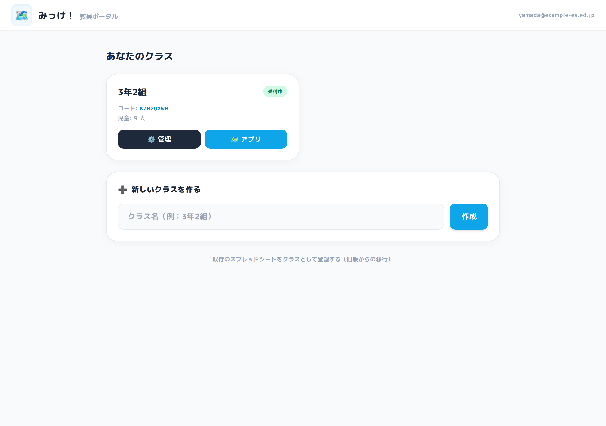

ひとりで複数のクラスを持てます。ほかの先生のクラスは見えません。管理できるのは、そのクラスを作った先生だけです。

### 学校にアプリそのものを用意する側の手順

このアプリは、学校のサーバーも、有料のサービスも使いません。アプリ運営用のグーグルアカウントを1つ用意して、Google Apps Script のプロジェクトを1本置き、そこから2種類の公開設定を発行します。入り口のページは GitHub Pages に置きます。この2つをつないでおけば、あとは先生に共通のリンクを伝えるだけで運用が始まります。

手順の細かいところと、つながらないときの調べかたは、リポジトリの README にまとめてあります。設定が正しいかどうかを自分で調べる診断ページも用意してあるので、入り口のリンクのうしろに diag.html をつけて開けば、どこで止まっているかが分かります。

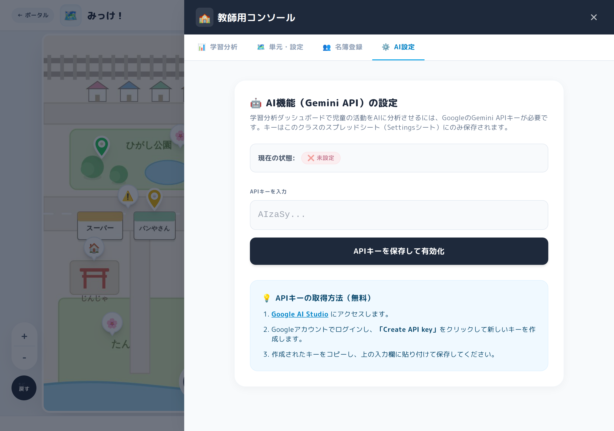

AI の鍵を入れる場所。ここを空のままにしても、ほかのすべての機能は使えます。

## 📖 【利用者向け】使い方のガイド

### 子どもがはじめて使うとき

1. 先生からもらったリンクを開くか、QR コードを読み取ります。
2. グーグルでサインインします。
3. 表示する名前を入れます。ニックネームでも構いません。出席番号は入れなくても大丈夫です。

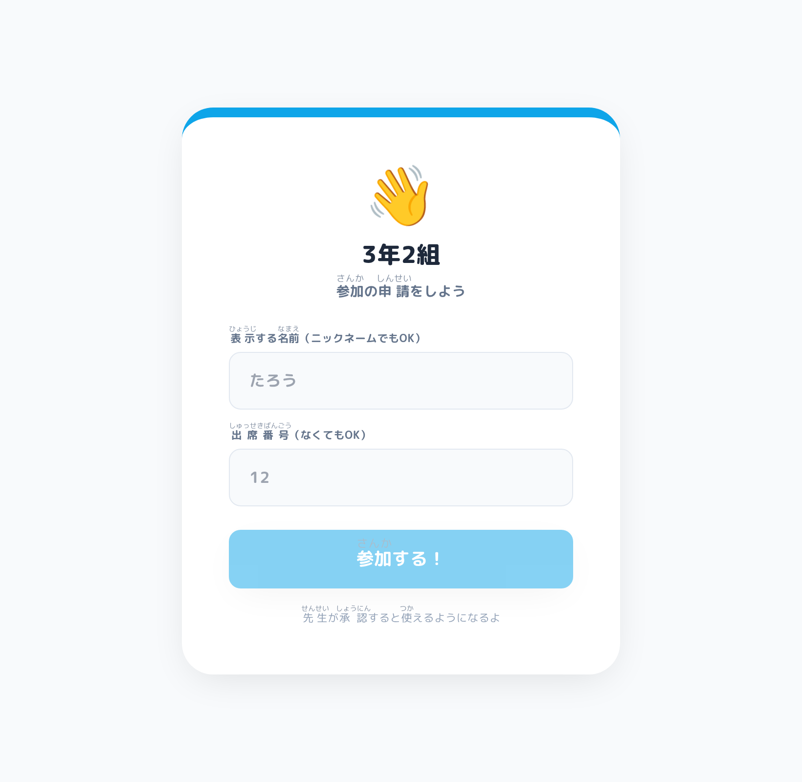

はじめて開いたときの画面。入れるのは名前だけです。

4. 参加するを押します。

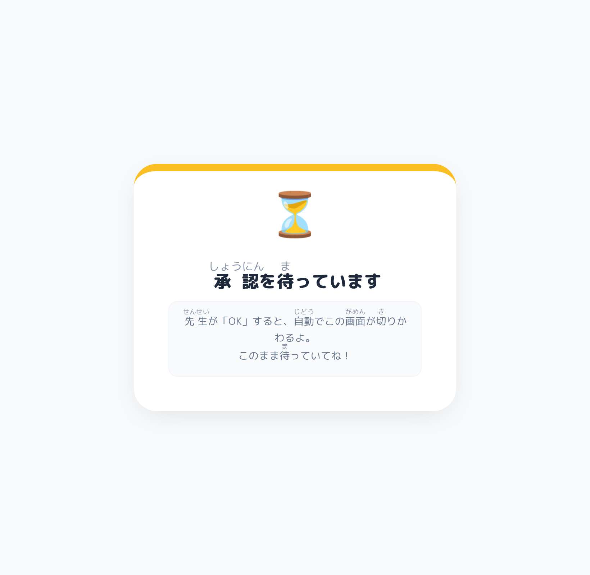

先生が承認するまでの画面。このまま待っていれば、自動で切りかわります。

### 授業中の子どもの操作

1. 画面の下のピンをさすを押します。
2. 地図の、見つけた場所をタップします。
3. アイコンを選び、なまえとメモを書き、必要なら写真をつけて、けっていを押します。
4. 友だちのピンを見たいときは、下のさわる・見るを押してから、ピンをタップします。
5. コメントを書きたいときは、ピンを開いていちばん下の入力欄に書きます。いいねはピンの右下の指のマークです。
6. 決められた範囲だけを見たいときは、かこんで見るを押して、地図を指でなぞって囲みます。
7. 自分の記録を見返すときは、右上のノートのマークを押します。

### 授業中の先生の操作

1. 管理画面のアプリを開くから、子どもと同じ画面に入れます。見本のピンを置くこともできます。

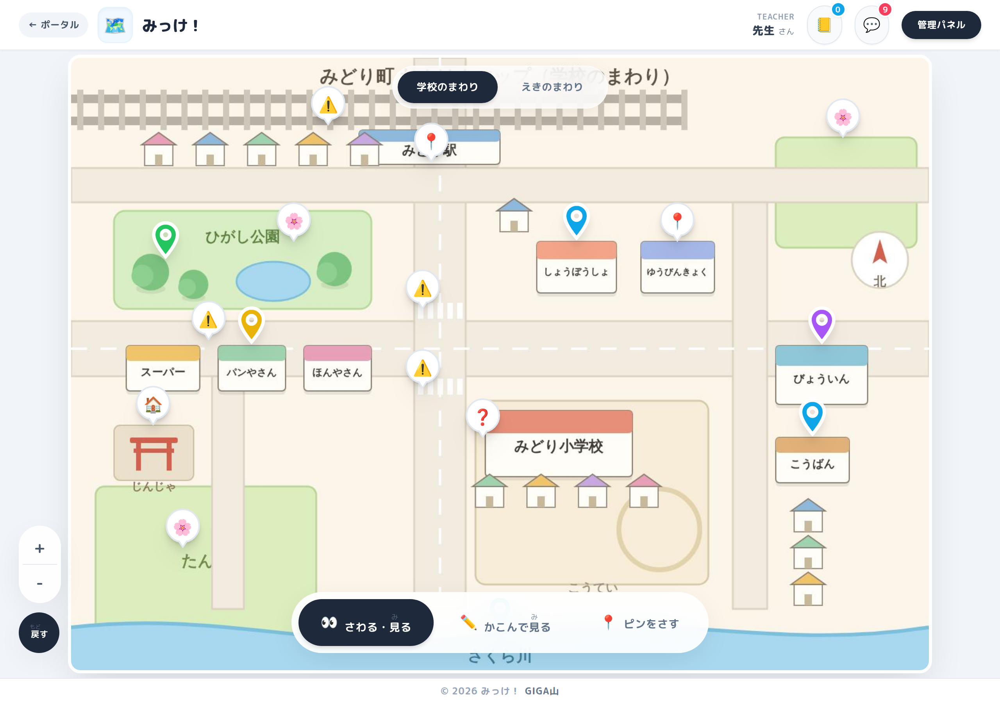

先生の画面には、右上に管理パネルのボタンが出ます。

2. 話し合いを止めたいときは、管理パネルの単元・設定で、みんなのひろばのスイッチを切ります。ピンへのコメントはそのまま書けます。
3. 見せたくない書きこみが入ったときは、そのピンを開いて削除します。先生はどの子のピンでも消せます。
4. 2枚目の地図を足したいときは、同じタブの新しい地図を追加から入れます。子どもの画面には上にタブが出ます。
5. 新しい単元を始めるときは、同じタブのいちばん下から始めます。子どもの画面は、読み込み直さなくても10秒から15秒ほどで切りかわります。前の単元の記録は消えず、スプレッドシートに残ります。
6. 記録を見るときは、管理パネルの学習分析で子どもを選びます。印刷を押すと、そのまま配れる形になります。

### うまくいかないとき

つないでいますのまま進まないときは、画面に出るべつのタブでひらくを試してください。それでも直らないときは、入り口のリンクのうしろに diag.html をつけて開くと、原因を自動で調べて表示します。

混み合っていますと出たときは、そのまま数秒待ってください。3回まで自動でやり直します。

写真が保存できないときは、画像が大きすぎます。もう少し小さい写真で試してください。

## 📝 まとめ

このアプリでやりたかったことは、子どもが見つけたものを、見つけた場所の上に置くことだけです。それだけで、ばらばらだった記録が一枚の地図の上で重なって、「わたしも見つけた」「どうしてここに多いんだろう」という次の言葉が出てくるのではないかと思っています。

ICT を入れる目的は、効率化そのものではないはずです。ワークシートを回収して並べる時間や、掲示物を作る時間が減ったぶんで、子どものそばに立って「よく気づいたね」と言える時間が増えるなら、それがいちばんの成果だと思います。この道具が、その時間を少しだけ増やす役に立てばうれしいです。

つまずいたところは、たいてい設定のところです。共通のリンクを開いてクラス名を入れるところまで来られれば、あとは地図を1枚選ぶだけです。まずは校庭の見取り図で、生きものさがしくらいの小さな単元から試してみてください。

一歩踏み出そうとする先生を、私はいつでも全力で応援しています。
